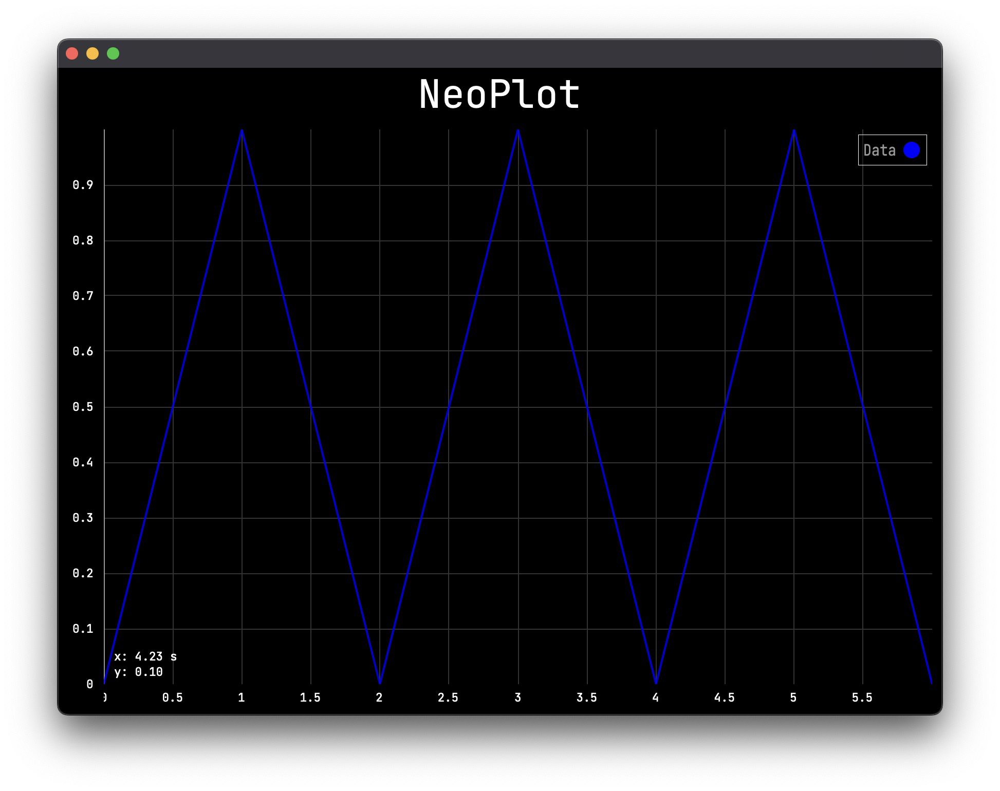

# neoplot

Juce Audio Data Plotting Library with blazingly fast mouse interaction.

Initally made for my master project [https://neodsp.com/](https://neodsp.com/).

Obviously you need to care about the Juce license if you wanna use this project, but you are free to use my extended code as is.



### Features

- Waveform and Magnitude Plots
- Automatic downsampling when there is a lot of data to show
- Click and drag to move around plot
- Move with two fingers on touchpad to move in every direction
- Pinch to Zoom gesture on touchpad/touchscreen
- Double click to reset
- Axis-Zoom with modifier keys (Option/Alt for x-Axis, Command/Ctrl for y-Axis)
- Interactive Legend with hover to detect and click to show/hide data

Check out the standalone example with the target name `NeoplotExample`.

## How to add to your CMake project

Add to CMakeLists.txt

```
Include(FetchContent)
FetchContent_Declare(
        neoplot
        GIT_REPOSITORY https://github.com/neodsp/neoplot.git
        GIT_TAG        master
)
FetchContent_MakeAvailable(neoplot)

# and add to your libraries
target_link_libraries(${PROJECT_NAME}
  PRIVATE
  neoplot
)
```

## How to use

- for a full example check out the standalone example

1. add `NeoPlot` instance to your Juce Component

```C++
#include <neoplot/NeoPlot.h>

class MainComponent : public Component
{
public:
    MainComponent();

    void paint(Graphics&) override;
    void resized() override;

private:
    neo::plot::NeoPlot<double> m_plot;

    JUCE_DECLARE_NON_COPYABLE_WITH_LEAK_DETECTOR(MainComponent)
};
```

2. set up the plot settings and data

```C++
// use one of the presets
// for time data
m_plot.settings = neo::plot::PlotSettings<double>::getTimePreset();
// for magnitude
m_plot.settings = neo::plot::PlotSettings<double>::getFreqPreset();
// or configure yourself
PlotSettings<double> settings;
settings.type = PlotType::logarithmic;
settings.yAxisInDb = true;
settings.mouseInteraction = true;
settings.mouseLabel = true;
settings.legend = true;
settings.xUnit = "Hz";
settings.yUnit = "dB";
settings.xMin = 20;
settings.xMax = 20e3;

// create a plot data object
neo::plot::PlotData<double> data;
// specify x-axis data
data.xData = std::vector<double> {0, 1, 2, 3, 4, 5, 6};
// specify y-axis data
data.yData = std::vector<double> {0, 1, 0, 1, 0, 1, 0};
// specify plot color
data.clr = juce::Colours::blue;
// specify name in legend
data.name = "Data";

// you can add as many PlotData objects as you want,
// they will be plotted in the order you add them
m_plot.addData(data);
```

3. add a size to the plot

```C++
void MainComponent::resized()
{
    auto bounds = getLocalBounds();
    m_plot.setBounds(bounds.reduced(10));
}
```

4. add `addAndMakeVisible()` to constructor

```C++
MainComponent::MainComponent()
{
    // ...
    addAndMakeVisible(m_plot);
}
```
